# STPA Report for ACC

## Table of Contents

1. [Losses](#losses)
2. [Hazards](#hazards)
3. [System-level Constraints](#system-level-constraints)
4. [Control Structure](#control-structure)
5. [Responsibilities](#responsibilities)
6. [UCAs](#ucas)
7. [Controller Constraints](#controller-constraints)
8. [Loss Scenarios](#loss-scenarios)
9. [Safety Requirements](#safety-requirements)
10. [Controller Constraints](#controller-constraints)
11. [Summarized Safety Constraints](#summarized-safety-constraints)

## Losses

**L01**: Vehicle is damaged  
**L02**: Loss of life or injury to people  

## Hazards

**H01**: Vehicle does not keep a minimum distance [L01, L02]  

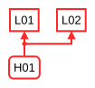

 

## System-level Constraints

**SC01**: Vehicle must satisfy minimum distance [H01]  

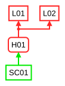

 

## Control Structure

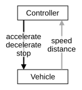

 

## Responsibilities

_Controller_  
**R01**: Decelerate when other vehicles are too close to keep a safe distance [SC01]  
**R02**: Stop when minimum distance to other vehicle is violated [SC01]  

_Vehicle_  
**R03**: Stop when commanded [SC01]  

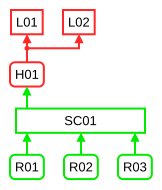

 

## UCAs

### _Controller.accelerate_

<table border="1px"  border-collapse="collapse">
<tr>
<th>not provided</th>
<th>provided</th>
<th>too late or too early</th>
<th>applied too long or stopped too soon</th>
</tr>
<tr><td>
undefined</td>
<td>
<b>UCA01</b>: Controller provided the control action accelerate, when dist = decDist. [H01]  <b>UCA02</b>: Controller provided the control action accelerate, when dist = stopDist. [H01]  <b>UCA03</b>: Controller provided the control action accelerate, when dist = okDist. [H01]</td>
<td>
<b>UCA04</b>: Controller provided the control action accelerate too-early, when dist = accDist. [H01]</td>
<td>
<b>UCA05</b>: Controller applied the control action accelerate too long, when dist = accDist. [H01]</td>
</tr>
</table>

 

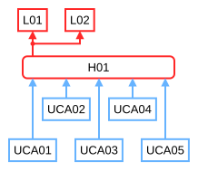

 

### _Controller.decelerate_

<table border="1px"  border-collapse="collapse">
<tr>
<th>not provided</th>
<th>provided</th>
<th>too late or too early</th>
<th>applied too long or stopped too soon</th>
</tr>
<tr><td>
<b>UCA06</b>: Controller not-provided the control action decelerate, when dist = decDist. [H01]</td>
<td>
undefined</td>
<td>
<b>UCA07</b>: Controller provided the control action decelerate too-late, when dist = decDist. [H01]</td>
<td>
<b>UCA08</b>: Controller stopped the control action decelerate too soon, when dist = decDist. [H01]</td>
</tr>
</table>

 

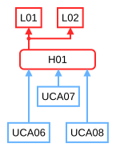

 

### _Controller.stop_

<table border="1px"  border-collapse="collapse">
<tr>
<th>not provided</th>
<th>provided</th>
<th>too late or too early</th>
<th>applied too long or stopped too soon</th>
</tr>
<tr><td>
<b>UCA09</b>: Controller not-provided the control action stop, when dist = stopDist. [H01]</td>
<td>
undefined</td>
<td>
<b>UCA10</b>: Controller provided the control action stop too-late, when dist = stopDist. [H01]</td>
<td>
undefined</td>
</tr>
</table>

 

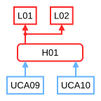

 

### _All UCAs_

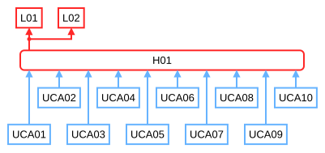

 

## Controller Constraints

### _Controller.accelerate_

**C01**: Controller must not provide the control action 'accelerate', while dist is decDist. [UCA01]  
**C02**: Controller must not provide the control action 'accelerate', while dist is stopDist. [UCA02]  
**C03**: Controller must not provide the control action 'accelerate', while dist is okDist. [UCA03]  
**C04**: Controller must not provide the control action 'accelerate' before dist is accDist. [UCA04]  
**C05**: Controller must not apply the control action 'accelerate' too long, while dist is accDist. [UCA05]

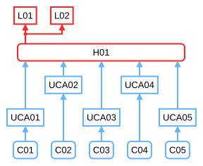

### _Controller.decelerate_

**C06**: Controller must provide the control action 'decelerate', while dist is decDist. [UCA06]  
**C07**: Controller must provide the control action 'decelerate' in time, while dist is decDist. [UCA07]  
**C08**: Controller must not stop the control action 'decelerate' too soon, while dist is decDist. [UCA08]

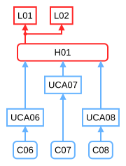

### _Controller.stop_

**C09**: Controller must provide the control action 'stop', while dist is stopDist. [UCA09]  
**C10**: Controller must provide the control action 'stop' in time, while dist is stopDist. [UCA10]

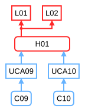

### _All Controller Constraints_

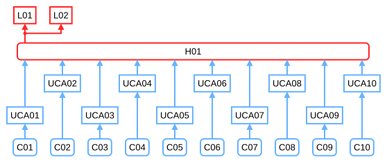

 

## Loss Scenarios

### Scenarios with associated UCA

#### _Controller.accelerate_

_UCA01_  
**Scenario01**: Controller provided the control action 'accelerate', while dist was decDist. Because Controller incorrectly believes that distance is accDist.  
**Scenario02**: Controller provided the control action 'accelerate', while dist was decDist. Because the distance sensor deteriorated over time leading to false measurment of the current distance.  
**Scenario03**: Controller provided the control action 'accelerate', while dist was decDist. Because the distance sensor broke.  
**Scenario04**: Controller provided the control action 'accelerate', while dist was decDist. Because the current distance is sent too late from the distance sensor.  
**Scenario05**: Controller provided the control action 'accelerate', while dist was decDist. Because the control algorithm did not calculate the safe distance correctly.  
**Scenario06**: Controller provided the control action 'accelerate', while dist was decDist. Because the distance sensor malfuntioned and sent the wrong distance value.  
**Scenario07**: Controller provided the control action 'accelerate', while dist was decDist. Because the distance sensor relocated leading to a wrong distance value.  
**Scenario08**: Controller provided the control action 'accelerate', while dist was decDist. Because the distance sensor did not sent any value.  

_UCA05_  
**Scenario09**: Controller applied the control action 'accelerate' too long, while dist was accDist. Because the calculation of the safe distance and hence the determination of the next control action is taking too long.  

_UCA04_  
**Scenario10**: Controller provided the control action 'accelerate' too early, while dist was accDist. Because the calculation of the safe distance is inaccurate.  

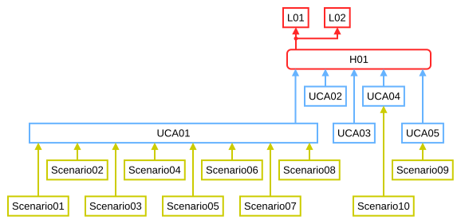

 

#### _Controller.decelerate_

_UCA06_  
**Scenario12**: Controller did not provide the control action 'decelerate', while dist was decDist. Because the measurment of the distance sensor got imprecise.  
**Scenario13**: Controller did not provide the control action 'decelerate', while dist was decDist. Because the motor actuator malfunctioned and hence the action could not be executed.  
**Scenario14**: Controller did not provide the control action 'decelerate', while dist was decDist. Because the controller had not enough power to determine and sent an action.  

_UCA07_  
**Scenario15**: Controller did not provide the control action 'decelerate', while dist was decDist. Because the determination of the correct control action is taking too long.  
**Scenario16**: Controller provided the control action 'decelerate' too late, while dist was decDist. Because the current distance is sent too late from the distance sensor.  

_UCA08_  
**Scenario17**: Controller stopped the control action 'decelerate' too soon, while dist was decDist. Because the distance sensor sent an inaccurate value.  

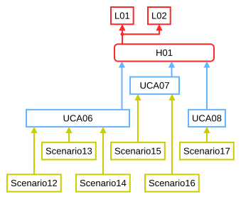

 

#### _Controller.stop_

_UCA09_  
**Scenario18**: Controller did not provide the control action 'stop', while dist was stopDist. Because Controller incorrectly believes that distance is decDist  

_UCA10_  
**Scenario19**: Controller provided the control action 'stop' too late, while dist was stopDist. Because the current distance is sent too late from the distance sensor.  

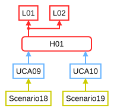

 

### Scenarios without associated UCA

**Scenario11**: Motor of the vehicle malfunctions, causing the vehicle to accelerate uncontrollably. [H01]

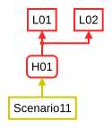

### All Scenarios

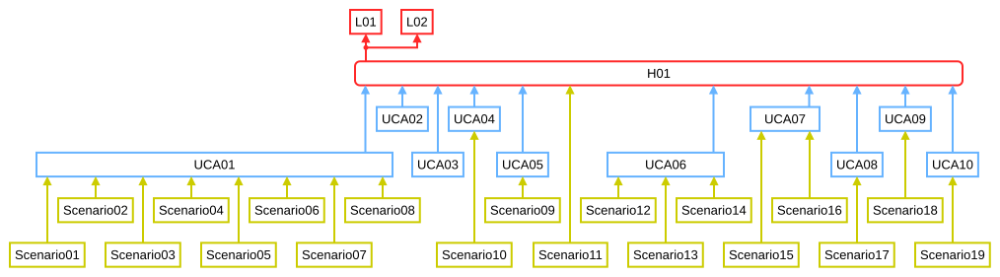

 

## Safety Requirements

**SR01**: Communication between sensor and controller must be sufficiently fast and reliable [Scenario01, Scenario04, Scenario16, Scenario19]  
**SR02**: Distance sensore must be checked regularly to prevent malfunction and deterioration [Scenario02, Scenario03, Scenario06, Scenario08]  
**SR03**: The control algorithm of the controller must be verified thoroughly [Scenario05, Scenario10]  
**SR04**: The distance sensor must be prevented form relocation [Scenario07]  
**SR05**: The control algorithm must be fast enough to sent control actions in time [Scenario09, Scenario15]  
**SR06**: Motor functionality must be checked regularly. [Scenario11, Scenario13]  
**SR07**: Power supply of the controller must be stable at all time [Scenario14]  
**SR08**: Distance sensor must be calibrated regularly to prevent inaccurate measurement [Scenario17, Scenario12, Scenario18]  

 

## Summarized Safety Constraints

**SC01**: Vehicle must satisfy minimum distance [H01]  
**C01**: Controller must not provide the control action 'accelerate', while dist is decDist. [UCA01]  
**C02**: Controller must not provide the control action 'accelerate', while dist is stopDist. [UCA02]  
**C03**: Controller must not provide the control action 'accelerate', while dist is okDist. [UCA03]  
**C04**: Controller must not provide the control action 'accelerate' before dist is accDist. [UCA04]  
**C05**: Controller must not apply the control action 'accelerate' too long, while dist is accDist. [UCA05]  
**C06**: Controller must provide the control action 'decelerate', while dist is decDist. [UCA06]  
**C07**: Controller must provide the control action 'decelerate' in time, while dist is decDist. [UCA07]  
**C08**: Controller must not stop the control action 'decelerate' too soon, while dist is decDist. [UCA08]  
**C09**: Controller must provide the control action 'stop', while dist is stopDist. [UCA09]  
**C10**: Controller must provide the control action 'stop' in time, while dist is stopDist. [UCA10]  
**SR01**: Communication between sensor and controller must be sufficiently fast and reliable [Scenario01, Scenario04, Scenario16, Scenario19]  
**SR02**: Distance sensore must be checked regularly to prevent malfunction and deterioration [Scenario02, Scenario03, Scenario06, Scenario08]  
**SR03**: The control algorithm of the controller must be verified thoroughly [Scenario05, Scenario10]  
**SR04**: The distance sensor must be prevented form relocation [Scenario07]  
**SR05**: The control algorithm must be fast enough to sent control actions in time [Scenario09, Scenario15]  
**SR06**: Motor functionality must be checked regularly. [Scenario11, Scenario13]  
**SR07**: Power supply of the controller must be stable at all time [Scenario14]  
**SR08**: Distance sensor must be calibrated regularly to prevent inaccurate measurement [Scenario17, Scenario12, Scenario18]  

  

STPA Report generated by PASTA, 2026-07-03 11:23:05 (https://github.com/kieler/stpa)