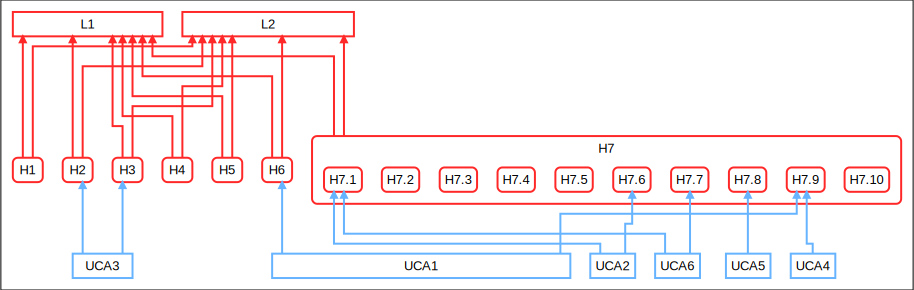

# STPA Report for Aircraft

## Table of Contents

1. [Losses](#losses)
2. [Hazards](#hazards)
3. [System-level Constraints](#system-level-constraints)
4. [Control Structure](#control-structure)
5. [Responsibilities](#responsibilities)
6. [UCAs](#ucas)
7. [Controller Constraints](#controller-constraints)
8. [Loss Scenarios](#loss-scenarios)
9. [Safety Requirements](#safety-requirements)
10. [Controller Constraints](#controller-constraints)
11. [Summarized Safety Constraints](#summarized-safety-constraints)
## Losses

**L1**: Loss of life or serious injury to people  
**L2**: Damage to the aircraft or objects outside the aircraft  

## Hazards

**H1**: Aircraft violate minimum separation standards in flight [L1, L2]  
**H2**: Controlled flight of aircraft into terrain [L1, L2]  
**H3**: Loss of aircraft control [L1, L2]  
**H4**: Aircraft airframe integrity is lost [L1, L2]  
**H5**: Aircraft environment is harmful to human health [L1, L2]  
**H6**: Aircraft departs designated taxiway, runway, or apron on ground [L1, L2]  
**H7**: Aircraft comes too close to other objects on the ground [L1, L2]  
&nbsp;&nbsp;&nbsp;&nbsp;&nbsp;&nbsp; **H7.1**: Deceleration is insufficient upon landing, rejected takeoff, or during taxiing   
&nbsp;&nbsp;&nbsp;&nbsp;&nbsp;&nbsp; **H7.2**: Asymmetric deceleration maneuvers aircraft toward other objects   
&nbsp;&nbsp;&nbsp;&nbsp;&nbsp;&nbsp; **H7.3**:  Deceleration occurs after V1 point during takeoff   
&nbsp;&nbsp;&nbsp;&nbsp;&nbsp;&nbsp; **H7.4**: Excessive acceleration provided while taxiing   
&nbsp;&nbsp;&nbsp;&nbsp;&nbsp;&nbsp; **H7.5**: Asymmetric acceleration maneuvers aircraft toward other objects   
&nbsp;&nbsp;&nbsp;&nbsp;&nbsp;&nbsp; **H7.6**: Acceleration is insufficient during takeoff   
&nbsp;&nbsp;&nbsp;&nbsp;&nbsp;&nbsp; **H7.7**: Acceleration is provided during landing or when parked   
&nbsp;&nbsp;&nbsp;&nbsp;&nbsp;&nbsp; **H7.8**: Acceleration continues to be applied during rejected takeoff   
&nbsp;&nbsp;&nbsp;&nbsp;&nbsp;&nbsp; **H7.9**: Insufficient steering to turn along taxiway, runway, or apron path   
&nbsp;&nbsp;&nbsp;&nbsp;&nbsp;&nbsp; **H7.10**: Steering maneuvers aircraft off the taxiway, runway, or apron path   

 

## System-level Constraints

**SC1**: Aircraft must satisfy minimum sperartion standards from other aircraft and objects [H1]  
**SC4**: Aircraft airfram integrity must be maintained under worst-case conditions [H4]  
**SC7**: Aircraft must have safe distance to other objects on the ground [H7]  
&nbsp;&nbsp;&nbsp;&nbsp;&nbsp;&nbsp; **SC7.1**: Deceleration must occur within TBD seconds of landing or rejected takeoff at a rate of at least TBD m/s2   
&nbsp;&nbsp;&nbsp;&nbsp;&nbsp;&nbsp; **SC7.2**: Asymmetric deceleration must not lead to loss of directional control or cause aircraft to depart taxiway, runway, or apron   
&nbsp;&nbsp;&nbsp;&nbsp;&nbsp;&nbsp; **SC7.3**: Deceleration must not be provided after V1 point during takeoff   

 

## Control Structure

 

## Responsibilities

_Wheels_  
**R1**: Decelerate wheels when commanded by BSCU or Flight Crew [SC7.1]  

_BSCU_  
**R2**: Actuate brakes when requested by flight crew [SC7.1]  
**R3**: Pulse brakes in case of a skid (Anti-skid) [SC7.2]  
**R4**: Automatically engage brakes on landing or rejected takeoff (Autobrake) [SC7.1]  

_FlightCrew_  
**R5**: Decide when braking is needed [SC7.1, SC7.3]  
**R6**: Decide how braking will be done: Autobrake, normal braking, or manual braking [SC7.1]  
**R7**: Configure BSCU and Autobrake to prepare for braking [SC7.1]  
**R8**: Monitor braking and disable BSCU, manually brake in case of malfunction [SC7.1, SC7.2]  

 

## UCAs

### _FlightCrew.manual_

<table border="1px"  border-collapse="collapse">
<tr>
<th>not provided</th>
<th>provided</th>
<th>too late or too early</th>
<th>applied too long or stopped too soon</th>
</tr>
<tr><td>
<b>UCA1</b>: FlightCrew not-provided the control action manual, when BCSUmode = off and aircraftPosition = taxiing. [H6, H7.9]  <b>UCA2</b>: FlightCrew not-provided the control action manual, when BCSUmode = off and aircraftPosition = takeoff. [H7.1, H7.6]  <b>UCA3</b>: FlightCrew not-provided the control action manual, when BCSUmode = off and aircraftPosition = landing. [H2, H3]</td>
<td>
<b>UCA5</b>: FlightCrew provided the control action manual, when BCSUmode = off and aircraftPosition = takeoff. [H7.8]  <b>UCA6</b>: FlightCrew provided the control action manual, when BCSUmode = off and aircraftPosition = landing. [H7.1, H7.7]</td>
<td>
<b>UCA4</b>: FlightCrew provided the control action manual too-late, when BCSUmode = off and aircraftPosition = taxiing. [H7.9]</td>
<td>
undefined</td>
</tr>
</table>

 

 

### _FlightCrew.powerOff_

<table border="1px"  border-collapse="collapse">
<tr>
<th>not provided</th>
<th>provided</th>
<th>too late or too early</th>
<th>applied too long or stopped too soon</th>
</tr>
<tr><td>
<b>UCA7</b>: FlightCrew not-provided the control action powerOff, when BCSUmode = on and aircraftPosition = taxiing. [H6, H7.1]  <b>UCA8</b>: FlightCrew not-provided the control action powerOff, when BCSUmode = on and aircraftPosition = takeoff. [H7.3]</td>
<td>
<b>UCA9</b>: FlightCrew provided the control action powerOff, when BCSUmode = on and aircraftPosition = landing. [H7.1]</td>
<td>
undefined</td>
<td>
undefined</td>
</tr>
</table>

 

 

### _FlightCrew.powerOn_

<table border="1px"  border-collapse="collapse">
<tr>
<th>not provided</th>
<th>provided</th>
<th>too late or too early</th>
<th>applied too long or stopped too soon</th>
</tr>
<tr><td>
<b>UCA10</b>: FlightCrew not-provided the control action powerOn, when BCSUmode = off and aircraftPosition = landing. [H7.1]</td>
<td>
<b>UCA11</b>: FlightCrew provided the control action powerOn, when BCSUmode = off and aircraftPosition = taxiing. [H6, H7.1]  <b>UCA12</b>: FlightCrew provided the control action powerOn, when BCSUmode = off and aircraftPosition = takeoff. [H7.3]</td>
<td>
undefined</td>
<td>
undefined</td>
</tr>
</table>

 

 

### _FlightCrew.mc_

<table border="1px"  border-collapse="collapse">
<tr>
<th>not provided</th>
<th>provided</th>
<th>too late or too early</th>
<th>applied too long or stopped too soon</th>
</tr>
<tr><td>
<b>UCA13</b>: FlightCrew not-provided the control action mc, when BCSUmode = off. [H3]  <b>UCA14</b>: FlightCrew not-provided the control action mc, when BCSUmode = on. [H2]</td>
<td>
undefined</td>
<td>
undefined</td>
<td>
undefined</td>
</tr>
</table>

 

 

### _All UCAs_

 

## Controller Constraints

### _FlightCrew.manual_

**C1**: BSCU Autobrake must provide the Brake control action during landing roll when the BSCU is armed [UCA1]  
**C2**: BSCU Autobrake must not provide Brake control action during a normal takeoff [UCA5]

### _FlightCrew.powerOff_

**C3**: BSCU Autobrake must provide the Brake control action within TBD seconds after touchdown [UCA8]

### _FlightCrew.powerOn_

**C4**: BSCU Autobrake must not stop providing the Brake control action before TBD taxi speed is attained during landing roll [UCA11]  
**C5**: BSCU Autobrake must not provide less than TBD level of braking during landing roll [UCA12]

### _All Controller Constraints_

 

## Loss Scenarios

### Scenarios with associated UCA

#### _FlightCrew.manual_

_UCA1_  
**Scenario1**: The BSCU Autobrake physical controller fails during landing roll when BSCU is armed, 
                    causing the Brake control action to not be provided. As a result, 
                    insufficient deceleration may be provided upon landing  

_UCA3_  
**Scenario2**: The aircraft lands, but processing delays within the BSCU result in the Brake control action being provided too late. 
                    As a result, insufficient deceleration may be provided upon landing  

_UCA2_  
**Scenario4**: The BSCU is armed and the aircraft begins landing roll. The BSCU does not provide the Brake control action 
                    because the BSCU incorrectly believes the aircraft has already come to a stop. 
                    This flawed process model will occur if the received feedback momentarily indicates zero speed 
                    during landing roll. The received feedback may momentarily indicate zero speed during anti-skid operation, 
                    even though the aircraft is not stopped  

 

#### _FlightCrew.powerOff_

_UCA7_  
**Scenario3**: Abnormal WBS behavior occurs and a BSCU fault indication is provided to the crew. 
                    The crew does not power off the BSCU because the operating procedures did not specify 
                    that the crew must power off the BSCU upon receiving a BSCU fault indication.  

 

### Scenarios without associated UCA

**Scenario5**: The BSCU sends the Brake command upon landing, but the brakes are not applied due to actuator failure. 
            As a result, insufficient deceleration may be provided upon landing [H7.1]  
**Scenario6**: The BSCU sends the Brake command upon landing, but insufficient braking is applied due to slow actuator response. 
            As a result, insufficient deceleration may be provided upon landing [H7.1]  
**Scenario7**: The BSCU does not send Brake command, but the brakes are applied due to hydraulic valve failure. 
            As a result, acceleration may be insufficient during takeoff [H7.6]

### All Scenarios

 

## Safety Requirements

**SR1**:  [Scenario1]  

 

## Summarized Safety Constraints

**SC1**: Aircraft must satisfy minimum sperartion standards from other aircraft and objects [H1]  
**SC4**: Aircraft airfram integrity must be maintained under worst-case conditions [H4]  
**SC7**: Aircraft must have safe distance to other objects on the ground [H7]  
**C1**: BSCU Autobrake must provide the Brake control action during landing roll when the BSCU is armed [UCA1]  
**C2**: BSCU Autobrake must not provide Brake control action during a normal takeoff [UCA5]  
**C3**: BSCU Autobrake must provide the Brake control action within TBD seconds after touchdown [UCA8]  
**C4**: BSCU Autobrake must not stop providing the Brake control action before TBD taxi speed is attained during landing roll [UCA11]  
**C5**: BSCU Autobrake must not provide less than TBD level of braking during landing roll [UCA12]  
**SR1**:  [Scenario1]  

  

STPA Report generated by PASTA, 2024-11-19 09:25:33 (https://github.com/kieler/stpa)