# STPA Report for ROLFER

## Table of Contents

1. [Losses](#losses)
2. [Hazards](#hazards)
3. [System-level Constraints](#system-level-constraints)
4. [Control Structure](#control-structure)
5. [Responsibilities](#responsibilities)
6. [UCAs](#ucas)
7. [Controller Constraints](#controller-constraints)
8. [Loss Scenarios](#loss-scenarios)
9. [Safety Requirements](#safety-requirements)
10. [Controller Constraints](#controller-constraints)
11. [Summarized Safety Constraints](#summarized-safety-constraints)

## Losses

**L1**: ROLFER was unable to execute a SAR mission (Loss of system goal)  
**L2**: Inadequate interactions with the public during the preparation mode (Loss of public trust)  
**L3**: A SP dies/injured due to drowning (Loss of mission goal)  
**L4**: People die or get injured due to a direct hit by the UAV (Loss of public trust)  
**L5**: Loss of system equipment, i.e., UAV, SW and Ground Station. (Property loss)  

## Hazards

**H1**: ROLFER was not properly prepared for its mission [L1, L2]  
**H2**: A SP is not served adequately during the phase of preparation and handling of a SW [L2]  
**H3**: The UAV does not approach the distressed human [L3, L5]  
**H4**: The UAV violates the minimum separation distance between itself and a person or an object/obstacle on the beach or the water level. [L3, L4, L5]  
**H5**: The UAV approaches the SP but does not provide rescue assistance to him/her [L3]  

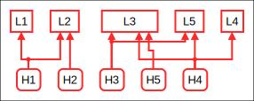

 

## System-level Constraints

**SC1**: ROLFER must be properly prepared for its mission. [H1]  
**SC2**: Every SP must be adequately served during the phase of preparation and handling of a SW [H2]  
**SC3**: The UAV must approach the distressed human [H3]  
**SC4**: The UAV must not violate the minimum separation distance between itself and a person or an object/obstacle on the beach or the water level [H4]  
**SC5**: The UAV must approach the SP and must provide rescue assistance to them [H5]  

 

## Control Structure

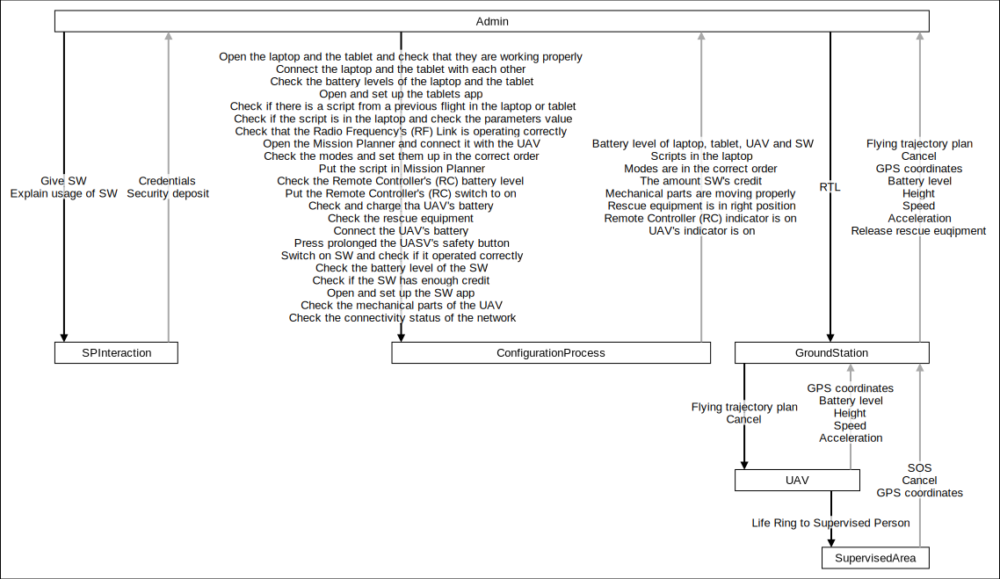

 

## Responsibilities

No Responsibilities defined.
## UCAs

### _Admin.sw_

<table border="1px"  border-collapse="collapse">
<tr>
<th>not provided</th>
<th>provided</th>
<th>too late or too early</th>
<th>applied too long or stopped too soon</th>
</tr>
<tr><td>
<b>UCA3</b>: Admin did not give the SW to a user, even though there were available SWs. [H2, H3]  <b>UCA4</b>: Admin ... [H2, H3]</td>
<td>
<b>UCA1</b>: Admin gave the SW to user, without some form of safety deposit [H2]  <b>UCA2</b>: Admin gave the SW to user without properly explaining the correct way of operating it [H2, H3]</td>
<td>
<b>UCA5</b>: Admin gave the SW to the user before making sure that the UAV is ready for its mission (e.g., the battery is full, the life ring is mounted, the engine motors are working). [H1, H3, H4, H5]  <b>UCA6</b>: admin gave the SW to a user before checking that the SW is ready for use (e.g., it's operating correctly, the SIM card is installed) [H1, H3]  <b>UCA7</b>: admin gave the SW to the user before setting up the approved numbers. [H1, H3]  <b>UCA8</b>: Admin gave the SW to the user before setting up the supervised area borders. [H1, H3]  <b>UCA9</b>: Admin gave the SW to the user before checking that the ground station equipment is operating correctly (e.g. The tablet is charged, the laptop is open, the software has been set up) [H1, H3, H5]</td>
<td>
</td>
</tr>
</table>

 

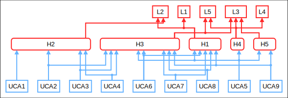

 

### _Admin.explain_

<table border="1px"  border-collapse="collapse">
<tr>
<th>not provided</th>
<th>provided</th>
<th>too late or too early</th>
<th>applied too long or stopped too soon</th>
</tr>
<tr><td>
<b>UCA10</b>: In every case [H2, H3]</td>
<td>
</td>
<td>
</td>
<td>
<b>UCA11</b>: Admin stopped the explanation of the operation of the SW, before it was completed. [H2, H3]</td>
</tr>
</table>

 

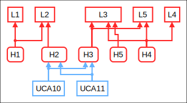

 

### _Admin.activateSW_

<table border="1px"  border-collapse="collapse">
<tr>
<th>not provided</th>
<th>provided</th>
<th>too late or too early</th>
<th>applied too long or stopped too soon</th>
</tr>
<tr><td>
<b>UCA12</b>: Admin did not check that the SW was operating correctly, while the SW was damaged/not working properly. [H1, H2, H3]  <b>UCA13</b>: Admin did not check that the SW was operating correctly, after it had been returned by a user. [H1, H2, H3]</td>
<td>
</td>
<td>
</td>
<td>
<b>UCA14</b>: admin stopped the execution of the command “Turn on the SW and check that it operates correctly” before it was completed, while it was malfunctioning. [H1, H2, H3]</td>
</tr>
</table>

 

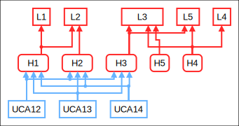

 

### _Admin.checkSWBattery_

<table border="1px"  border-collapse="collapse">
<tr>
<th>not provided</th>
<th>provided</th>
<th>too late or too early</th>
<th>applied too long or stopped too soon</th>
</tr>
<tr><td>
<b>UCA15</b>: Admin did not check the battery level of the SW, while it was not enough to complete the mission. [H1, H2, H3]</td>
<td>
</td>
<td>
</td>
<td>
<b>UCA16</b>: admin gave the SW to the user, before the level of the battery reached the level that would allow for mission completion. [H1, H2, H3]</td>
</tr>
</table>

 

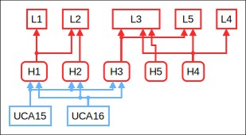

 

### _Admin.checkSWCredit_

<table border="1px"  border-collapse="collapse">
<tr>
<th>not provided</th>
<th>provided</th>
<th>too late or too early</th>
<th>applied too long or stopped too soon</th>
</tr>
<tr><td>
<b>UCA17</b>: admin did not check if the SW SIM card has enough balance and gave it to a user. [H1, H2, H3]</td>
<td>
</td>
<td>
</td>
<td>
</td>
</tr>
</table>

 

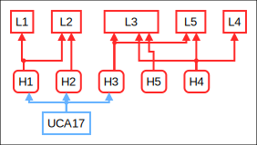

 

### _Admin.openSWApp_

<table border="1px"  border-collapse="collapse">
<tr>
<th>not provided</th>
<th>provided</th>
<th>too late or too early</th>
<th>applied too long or stopped too soon</th>
</tr>
<tr><td>
<b>UCA48</b>: in any case. [H1, H3]</td>
<td>
</td>
<td>
<b>UCA49</b>: Admin opened and set up the app on the tablet, after having given SW to users. [H1, H3]</td>
<td>
</td>
</tr>
</table>

 

 

### _Admin.checkUAVBattery_

<table border="1px"  border-collapse="collapse">
<tr>
<th>not provided</th>
<th>provided</th>
<th>too late or too early</th>
<th>applied too long or stopped too soon</th>
</tr>
<tr><td>
<b>UCA19</b>: Admin did not check the level of the battery of the UAV. [H1, H3, H4]</td>
<td>
<b>UCA18</b>: Admin put the battery in the charger, but the battery did not charge. [H1, H3, H4]</td>
<td>
<b>UCA20</b>: Admin charged the battery of the UAV after having given the SW to the users (the mission might begin while the UAV is not operating). [H1, H3, H4]</td>
<td>
<b>UCA21</b>: Admin stopped charging the UAV’s battery, before it reached the required level of charging. [H1, H3, H4]  <b>UCA22</b>: admin did not check if the battery was discharged after the UAV ended its missions for the time being. [H1]</td>
</tr>
</table>

 

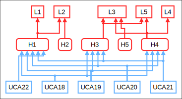

 

### _Admin.checkUAVMechanicals_

<table border="1px"  border-collapse="collapse">
<tr>
<th>not provided</th>
<th>provided</th>
<th>too late or too early</th>
<th>applied too long or stopped too soon</th>
</tr>
<tr><td>
<b>UCA23</b>: admin did not check the mechanical parts of the UAV, while the life ring servo mechanism was damaged/not working properly. [H1, H5]  <b>UCA24</b>: admin did not check the mechanical parts of the UAV after the end of a mission and before a next mission took place. [H1, H5]  <b>UCA25</b>: admin did not check the mechanical parts of the UAV, while they have seen an unnatural behavior of the UAV during a flight. [H1, H3]  <b>UCA26</b>: admin did not check the mechanical parts of the UAV, while one propeller was damaged/not working properly. [H1, H3, H4]  <b>UCA27</b>: admin did not check the mechanical parts of the UAV, while one motor was damaged/not working properly. [H1, H3, H4]  <b>UCA28</b>: admin did not check the mechanical parts of the UAV, while the mechanical frame of the UAV was not properly secured. [H1, H3, H4]  <b>UCA29</b>: admin did not check the mechanical parts of the UAV, while one of the internal components was damaged/not working properly (gyroscope, altimeter, speedometer, accelerometer, obstacle avoidance system, compass). [H1, H3, H4, H5]</td>
<td>
</td>
<td>
</td>
<td>
</td>
</tr>
</table>

 

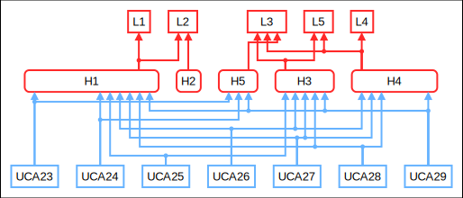

 

### _Admin.checkRescueEquip_

<table border="1px"  border-collapse="collapse">
<tr>
<th>not provided</th>
<th>provided</th>
<th>too late or too early</th>
<th>applied too long or stopped too soon</th>
</tr>
<tr><td>
<b>UCA30</b>: admin did not check the rescue equipment, while a part of it was damaged. [H1, H5]  <b>UCA31</b>: admin did not check the rescue equipment, while there was a problem with the life ring release mechanism. [H1, H5]  <b>UCA32</b>: admin did not check the rescue equipment, while the life ring was not attached to the UAV. [H1, H5]</td>
<td>
</td>
<td>
<b>UCA33</b>: admin checked the rescue equipment before connecting the UAV with the Mission planner (when you connect the UAV to the MP, it opens the life ring release mechanism). [H1, H5]</td>
<td>
</td>
</tr>
</table>

 

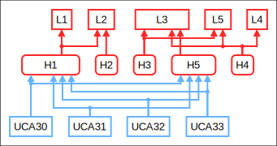

 

### _Admin.connectUAVBattery_

<table border="1px"  border-collapse="collapse">
<tr>
<th>not provided</th>
<th>provided</th>
<th>too late or too early</th>
<th>applied too long or stopped too soon</th>
</tr>
<tr><td>
<b>UCA34</b>: in any case. [H1, H3]</td>
<td>
</td>
<td>
</td>
<td>
</td>
</tr>
</table>

 

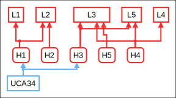

 

### _Admin.UAVSafetyButton_

<table border="1px"  border-collapse="collapse">
<tr>
<th>not provided</th>
<th>provided</th>
<th>too late or too early</th>
<th>applied too long or stopped too soon</th>
</tr>
<tr><td>
<b>UCA35</b>: in any case. [H1, H3]</td>
<td>
</td>
<td>
<b>UCA36</b>: admin long pressed UAV safety button, after having given SW to users. [H1, H3]  <b>UCA37</b>: admin longed pressed the UAVs safety button before connecting it to Mission planner. [H1, H3]  <b>UCA38</b>: Admin long pressed the UAVs safety button, after running the script on Mission Planner. [H1, H3]  <b>UCA39</b>: Admin long pressed the UAVs safety button, before turning on the UAVs controller. [H1, H3]</td>
<td>
</td>
</tr>
</table>

 

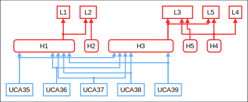

 

### _Admin.open_

<table border="1px"  border-collapse="collapse">
<tr>
<th>not provided</th>
<th>provided</th>
<th>too late or too early</th>
<th>applied too long or stopped too soon</th>
</tr>
<tr><td>
<b>UCA40</b>: in any case. [H1, H3]</td>
<td>
</td>
<td>
<b>UCA41</b>: admin opened the laptop and tablet to check that they are working correctly, after giving the SW to users. [H1, H3]</td>
<td>
</td>
</tr>
</table>

 

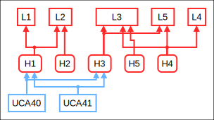

 

### _Admin.connectDevices_

<table border="1px"  border-collapse="collapse">
<tr>
<th>not provided</th>
<th>provided</th>
<th>too late or too early</th>
<th>applied too long or stopped too soon</th>
</tr>
<tr><td>
<b>UCA43</b>: in any case. [H1, H3]</td>
<td>
<b>UCA42</b>: Admin connected the tablet to the laptop, while the laptop did not recognize the device. [H1, H3]</td>
<td>
<b>UCA44</b>: Admin connected the tablet with the laptop after having given SWs to users. [H1, H3]</td>
<td>
</td>
</tr>
</table>

 

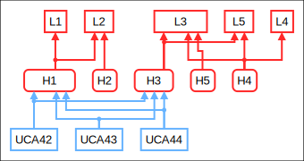

 

### _Admin.checkBattery_

<table border="1px"  border-collapse="collapse">
<tr>
<th>not provided</th>
<th>provided</th>
<th>too late or too early</th>
<th>applied too long or stopped too soon</th>
</tr>
<tr><td>
<b>UCA45</b>: Admin did not check the laptop and tablet batteries, while one of them was not fully charged [H1, H3]</td>
<td>
</td>
<td>
<b>UCA46</b>: Admin did not check the laptop and tablet batteries, while one of them was not charged and the mission had begun. [H1, H3]  <b>UCA47</b>: Admin checked the laptop and tablet batteries, after having given SW to users. [H1, H3]</td>
<td>
</td>
</tr>
</table>

 

 

### _Admin.checkPrevScripts_

<table border="1px"  border-collapse="collapse">
<tr>
<th>not provided</th>
<th>provided</th>
<th>too late or too early</th>
<th>applied too long or stopped too soon</th>
</tr>
<tr><td>
<b>UCA50</b>: Admin did not check if there is an old flight plan on the tablet and the laptop, while one was loaded. [H1, H3]</td>
<td>
</td>
<td>
<b>UCA51</b>: Admin checked if here is an old flight plan on the tablet and the laptop after having given SW to users. [H1, H3]</td>
<td>
</td>
</tr>
</table>

 

 

### _Admin.checkScriptLaptop_

<table border="1px"  border-collapse="collapse">
<tr>
<th>not provided</th>
<th>provided</th>
<th>too late or too early</th>
<th>applied too long or stopped too soon</th>
</tr>
<tr><td>
<b>UCA52</b>: Admin did not check if the script is in the laptop, while it was not. [H1, H3]  <b>UCA53</b>: Admin did not check if the values were set up correctly, while they were not. [H1, H3]</td>
<td>
</td>
<td>
<b>UCA54</b>: Admin checked if the script is in the laptop and if the values are correct, after having given SW to users. [H1, H3]</td>
<td>
</td>
</tr>
</table>

 

 

### _Admin.checkRFLink_

<table border="1px"  border-collapse="collapse">
<tr>
<th>not provided</th>
<th>provided</th>
<th>too late or too early</th>
<th>applied too long or stopped too soon</th>
</tr>
<tr><td>
<b>UCA55</b>: Admin did not check if the RF link is working, while it was not. [H1, H3, H5]</td>
<td>
</td>
<td>
<b>UCA56</b>: Admin checked if the RF link works, after having given SW to users. [H1, H3, H5]</td>
<td>
</td>
</tr>
</table>

 

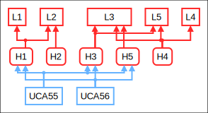

 

### _Admin.openPlaner_

<table border="1px"  border-collapse="collapse">
<tr>
<th>not provided</th>
<th>provided</th>
<th>too late or too early</th>
<th>applied too long or stopped too soon</th>
</tr>
<tr><td>
<b>UCA57</b>: in any case. [H1, H3]</td>
<td>
</td>
<td>
<b>UCA58</b>: Admin... [H1, H3]</td>
<td>
</td>
</tr>
</table>

 

 

### _Admin.checkModes_

<table border="1px"  border-collapse="collapse">
<tr>
<th>not provided</th>
<th>provided</th>
<th>too late or too early</th>
<th>applied too long or stopped too soon</th>
</tr>
<tr><td>
<b>UCA59</b>: in any case. [H1, H3]</td>
<td>
</td>
<td>
<b>UCA60</b>: Admin checked the modes, after having given SW to users. [H1, H3]</td>
<td>
</td>
</tr>
</table>

 

 

### _Admin.scriptToMP_

<table border="1px"  border-collapse="collapse">
<tr>
<th>not provided</th>
<th>provided</th>
<th>too late or too early</th>
<th>applied too long or stopped too soon</th>
</tr>
<tr><td>
<b>UCA62</b>: in any case. [H1, H3]</td>
<td>
<b>UCA61</b>: Admin uploaded the wrong script to the Mission Planner. [H1, H3]</td>
<td>
<b>UCA63</b>: Admin had run the script on the Mission planner, after having given SW to users. [H1, H3]  <b>UCA64</b>: Admin had run the script on the Mission planner, before connecting the UAV with the Mission Planner. [H1, H3]  <b>UCA65</b>: Admin had run the script on the Mission planner, before connecting the UAV with its battery. [H1, H3]  <b>UCA66</b>: Admin had run the script on the Mission planner, before turning on the UAVs controller. [H1, H3]</td>
<td>
</td>
</tr>
</table>

 

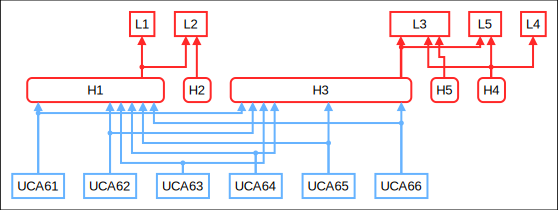

 

### _Admin.checkRCBattery_

<table border="1px"  border-collapse="collapse">
<tr>
<th>not provided</th>
<th>provided</th>
<th>too late or too early</th>
<th>applied too long or stopped too soon</th>
</tr>
<tr><td>
<b>UCA67</b>: in any case. [H1, H3]</td>
<td>
</td>
<td>
<b>UCA68</b>: Admin checked the controller's battery, after having given SW to users. [H1, H3]</td>
<td>
</td>
</tr>
</table>

 

 

### _Admin.activateRC_

<table border="1px"  border-collapse="collapse">
<tr>
<th>not provided</th>
<th>provided</th>
<th>too late or too early</th>
<th>applied too long or stopped too soon</th>
</tr>
<tr><td>
<b>UCA69</b>: in any case. [H1, H3]</td>
<td>
</td>
<td>
<b>UCA70</b>: Admin turned on the UAV's controller, before connecting the UAV with the Mission Planner. [H1, H3]  <b>UCA71</b>: Admin turned on the UAV's controller after having given SW to users. [H1, H3]</td>
<td>
</td>
</tr>
</table>

 

 

### _Admin.checkConnectivity_

<table border="1px"  border-collapse="collapse">
<tr>
<th>not provided</th>
<th>provided</th>
<th>too late or too early</th>
<th>applied too long or stopped too soon</th>
</tr>
<tr><td>
<b>UCA72</b>: Admin did not check connectivity status of the networks, while one of them had connectivity issues. [H1, H3, H5]</td>
<td>
</td>
<td>
<b>UCA73</b>: Admin checked the network connectivity, after having given SW to users. [H1, H3, H5]</td>
<td>
</td>
</tr>
</table>

 

 

### _Admin.rtl_

<table border="1px"  border-collapse="collapse">
<tr>
<th>not provided</th>
<th>provided</th>
<th>too late or too early</th>
<th>applied too long or stopped too soon</th>
</tr>
<tr><td>
<b>UCA75</b>: Admin did not give the RTL command through mission planner, while there was a visible mechanical failure. [H3, H4, H5]  <b>UCA76</b>: Admin did not give the RTL command through mission planner, while the UAV had left the boundaries of the supervised area. [H4]  <b>UCA77</b>: Admin did not give the RTL command through mission planner, while there were adverse weather conditions for flying. [H3, H4, H5]</td>
<td>
<b>UCA74</b>: Admin gave the RTL command through Mission Planner, while the mission was being executed properly. [H3, H5]</td>
<td>
</td>
<td>
</td>
</tr>
</table>

 

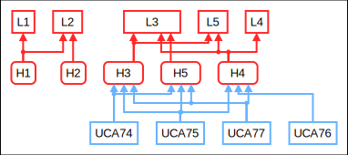

 

### _UAV.lifeRing_

<table border="1px"  border-collapse="collapse">
<tr>
<th>not provided</th>
<th>provided</th>
<th>too late or too early</th>
<th>applied too long or stopped too soon</th>
</tr>
<tr><td>
<b>UCA82</b>: Pixhawk Controller did not give the control action “Drop the life ring”, while a user had pressed the HELP command. [H5]</td>
<td>
<b>UCA78</b>: Pixhawk Controller gave the control action “Drop the life ring”, while the UAV was not at the correct GPS coordinates. [H3, H4, H5]  <b>UCA79</b>: Pixhawk Controller gave the control action “Drop the life ring”, while the UAV was not equipped with a life ring. [H1, H5]  <b>UCA80</b>: Pixhawk Controller gave the control action “Drop the life ring”, while the release mechanism was malfunctioning/ was broken. [H1, H4, H5]  <b>UCA81</b>: Pixhawk Controller gave the control action “Drop the life ring”, while the user had pressed the CANCEL command. [H4]</td>
<td>
<b>UCA83</b>: Pixhawk Controller gave the control action “Drop the life ring”, before the UAV reached the users coordinates. [H3, H4]  <b>UCA84</b>: Pixhawk Controller gave the control action “Drop the life ring”, before the UAV descended on the correct height. [H3, H4, H5]</td>
<td>
</td>
</tr>
</table>

 

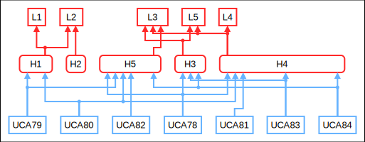

 

### _GroundStation.cancel_

<table border="1px"  border-collapse="collapse">
<tr>
<th>not provided</th>
<th>provided</th>
<th>too late or too early</th>
<th>applied too long or stopped too soon</th>
</tr>
<tr><td>
<b>UCA86</b>: Ground station did not send the command cancel, while the user has pressed the cancel button. [H4]</td>
<td>
<b>UCA85</b>: Ground station sent the command cancel, while the user had not pressed the cancel button. [H3, H5]</td>
<td>
<b>UCA87</b>: Ground station sent the command cancel, after the UAV had released the life ring. [H4]</td>
<td>
</td>
</tr>
</table>

 

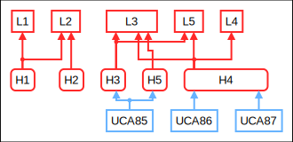

 

### _GroundStation.trajectory_

<table border="1px"  border-collapse="collapse">
<tr>
<th>not provided</th>
<th>provided</th>
<th>too late or too early</th>
<th>applied too long or stopped too soon</th>
</tr>
<tr><td>
<b>UCA98</b>: ground station did not execute the send the flight plan to UAV command, while a user has pressed the HELP button. [H3, H4, H5]</td>
<td>
<b>UCA88</b>: ground station executed the send the flight plan to UAV command, while there was a mechanical failure on it. [H3, H4, H5]  <b>UCA89</b>: ground station executed the send the flight plan to UAV command, while the altimeter was damaged/not working properly. [H1, H3, H4, H5]  <b>UCA90</b>: ground station executed the send the flight plan to UAV command, while the GPS was damaged/not working properly. [H1, H3, H4, H5]  <b>UCA91</b>: ground station executed the send the flight plan to UAV command, while the battery was not charged adequately. [H1, H3, H4, H5]  <b>UCA92</b>: ground station executed the send the flight plan to UAV command, while more than one motors was damaged/not working properly. [H1, H3, H4, H5]  <b>UCA93</b>: ground station executed the send the flight plan to UAV command, while more than one propeller was damaged/not working properly. [H1, H3, H4, H5]  <b>UCA94</b>: ground station executed the send the flight plan to UAV command, while both a motor and a propeller, on different wings, were damaged/not working properly. [H1, H2, H3]  <b>UCA95</b>: ground station executed the send the flight plan to UAV command, while the RC was not turned on. [H1, H3]  <b>UCA96</b>: ground station executed the send the flight plan to UAV command, while there were obstacles in the flight path. [H1, H2]  <b>UCA97</b>: ground station executed the send the flight plan to UAV command, while the weather conditions were adverse for flying. [H1, H2]</td>
<td>
<b>UCA99</b>: ground station executed the send the flight plan to UAV command, after the coordinates update has stopped and the user had changed position. [H3]  <b>UCA100</b>: ground station executed the send the flight plan to UAV command, before the life ring has been mounted on the UAV. [H1, H5]</td>
<td>
</td>
</tr>
</table>

 

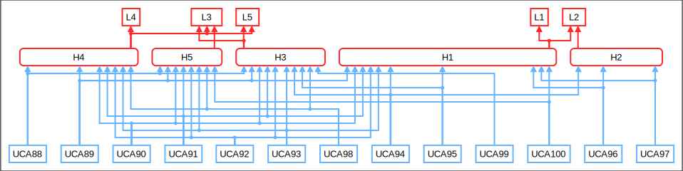

 

### _All UCAs_

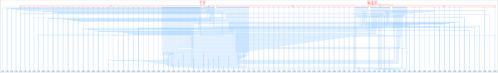

 

## Controller Constraints

No constraints defined.
### _All Controller Constraints_

 

## Loss Scenarios

### Scenarios with associated UCA

#### _Admin.sw_

_UCA1_  
**S1**: Admin gave the SW to user, without some form of safety deposit, because they did not think that having a security deposit is important.  
**Scenario2**: Admin gave the SW to user, without some form of safety deposit, because they had a lot of users to serve and did not had enough time to ask for it, or they forgot to ask for the deposit from the user.  

_UCA2_  
**S3**: Admin gave the SW to user without properly explaining the correct way of operating it, because  they did not know that they should explain the correct way of operating it to every user.  
**S4**: Admin gave the SW to user without properly explaining the correct way of operating it, because they did not know what they should inform the user about, since they were not properly trained.  
**S5**: Admin gave the SW to user without properly explaining the correct way of operating it, because they had a lot of users to attend to and did not had enough time to correctly explain the operation to each one of them, resulting in some of them not understating the correct operation.  
**S6**: Admin gave the SW to user without properly explaining the correct way of operating it, because they assumed that the user knew how to operate the SW.  

_UCA3_  
**S7**: Admin did not give the SW to a user, even though there were available SWs, because they were not attending their post.  
**S8**: Admin did not give the SW to a user, even though there were available SWs and they were attending their post, because they were preoccupied with another activity.  
**S9**: Admin did not give the SW to a user, even though there were available SWs, because they did not have a list with the available SWs each moment, and they did not know if they had any available.  

_UCA4_  
**S10**: Admin did not administer SW to users according to the priority list, because he was not aware of the appropriate criteria to create a priority list.  
**S11**: Admin did not administer SW to users according to the priority list, because they saw not aware that the person requesting a SW was on the list, because the person requesting a SW was not aware that they needed to disclose the appropriate information, either due to a missing sign or update about the priority list.  
**S12**: Admin did not administer SW to users according to the priority list, because there are a lot of people requesting SWs and they decided to ignore the priority list due to not having sufficient time to check all people and create the priority list.  

_UCA5_  
**S13**: Admin gave the SW to the user before making sure that the UAV is ready for its mission, because they did not know that they had to do check that before handing out the SW.  
**S14**: Admin gave the SW to the user before making sure that the UAV is ready for its mission, because they did not know how often they should check that.  
**S15**: Admin gave the SW to the user before making sure that the UAV is ready for its mission, because they did not had enough time to perform the checks.  
**S16**: Admin gave the SW to the user before making sure that the UAV is ready for its mission, because they did not know how to perform the checks.  

_UCA6_  
**S17**: Admin gave the SW to a user before checking that the SW is ready for use, because they did not know that they had to do the checks before giving out SWs to users.  
**S18**: Admin gave the SW to a user before checking that the SW is ready for use, because they did not know how often they should perform the checks, resulting in a user getting a SW that has not been checked between missions.  
**S19**: Admin gave the SW to a user before checking that the SW is ready for use, because they did not had enough time to perform the checks.  
**S20**: Admin gave the SW to a user before checking that the SW is ready for use, because they did not know how to perform the checks.  
**S21**: Admin gave the SW to a user before checking that the SW is ready for use, because they stopped the checks before completing then, due to the false belief that the missions would continue running smoothly and the checks would not show a problem.  

_UCA7_  
**S22**: Admin gave the SW to the user before setting up the approved numbers, because they did not know that this was their responsibility.  
**S23**: Admin gave the SW to the user before setting up the approved numbers, because they did not know that they had to do this before starting handing out SW to users.  

_UCA8_  
**S24**: Admin gave the SW to the user before setting up the supervised area borders, because they did not know that this action should happen before handing out the SW to the users.  

_UCA9_  
**S25**: Admin gave the SW to the user before checking that the ground station equipment is operating correctly, because they did not know that this action should happen before handing out the SW to the users, or because they did not think that those checks were necessary.  

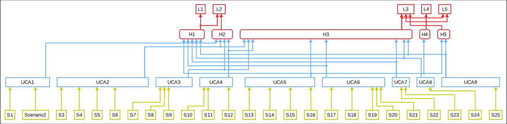

 

#### _Admin.checkUAVBattery_

_UCA18_  
**S26**: Admin put the battery in the charger, but the battery did not charge, because the charger was malfunctioning.  
**S27**: Admin put the battery in the charger, but the battery did not charge, because the charging cable was malfunctioning.  

_UCA19_  
**S28**: Admin did not check the level of the battery of the UAV, because they had just removed the battery from the charger and assumed that it would be charged, something that did not happened due to a malfunction of the charger.  
**S29**: Admin did not check the level of the battery of the UAV, because they had just removed the battery from the charger and assumed that it would be charged, something that did not happened due to a malfunction of the charging cable.  
**S30**: Admin did not check the level of the battery of the UAV, because they had just removed the battery from the charger and assumed that it would be charged, something that did not happened because they forgot to connect the charger to the power supply.  
**S31**: Admin did not check the level of the battery of the UAV, because they had just removed the battery from the charger and assumed that it would be charged, something that did not happened due to power cut in the area.  
**S32**: Admin did not check the level of the battery of the UAV, because they had just removed the battery from the charger and assumed that it would be charged, something that did not happened due to a malfunction of the battery.  
**S33**: Admin did not check the level of the battery of the UAV, because they had neglected it.  
**S34**: Admin did not check the level of the battery of the UAV, because they did not know that they had to do it.  
**S35**: Admin did not check the level of the battery of the UAV, because they did not had enough time to do it.  

_UCA20_  
**S36**: Admin charged the battery of the UAV after having given the SW to the users, because they did not know that the charging of the battery must precede the handing of the SW to the users.  
**S37**: Admin charged the battery of the UAV after having given the SW to the users, because they did not had enough time to do it before giving the SW to the users.  

_UCA21_  
**S38**: Admin stopped charging the UAV's battery, before it reached the required level of charging, because they assumed that the time that had elapsed was enough to charge the battery to the required level.  

_UCA22_  
**S39**: Admin placed the battery into the charging station, but did not checked if it was on the discharging mode, resulting in the battery being charged instead of discharged and staying charged after the end of the missions.  

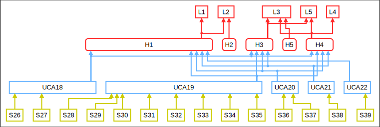

 

#### _Admin.rtl_

_UCA74_  
**S40**: The RTL command was given because the ground station was not supervised and a non-qualified person gave the command.  
**S41**: Admin gave the RTL command because they followed orders from the police or civil protection.  

_UCA75_  
**S42**: Admin did not give the RTL command through mission planner, while there was a visible mechanical failure, because they had not completed the necessary checks and they did not know that the UAV had the mechanical failure.  
**S43**: Admin did not give the RTL command through mission planner, while there was a visible mechanical failure, because there was not an audio or visual feedback that informed of a mechanical failure.  
**S44**: Admin did not give the RTL command through mission planner, while there was a visible mechanical failure, because they were busy with another responsibility.  
**S45**: Admin did not give the RTL command through mission planner, while there was a visible mechanical failure, because the laptop was not working properly and they could not get the necessary feedback.  
**S46**: Admin did not give the RTL command through mission planner, while there was a visible mechanical failure, because they were tired due to working more hours than recommended on a single shift.  

_UCA76_  
**S47**: Admin did not give the RTL command through mission planner, while the UAV had left the boundaries of the supervised area, because there was not a way to alert the admin about that.  
**S48**: Admin did not give the RTL command through mission planner, while the UAV had left the boundaries of the supervised area, because the laptop was not working properly.   
**S49**: Admin did not give the RTL command through mission planner, while the UAV had left the boundaries of the supervised area, because the Mission Planner only displays the coordinate values at a certain moment, making it difficult for a human to understand the position.  

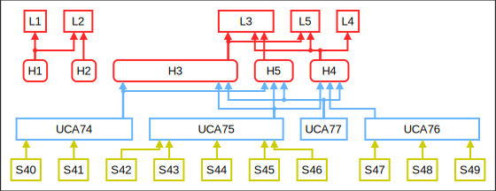

 

#### _UAV.lifeRing_

_UCA78_  
**S50**: Pixhawk Controller gave the control action “Drop the life ring”, while the UAV was not at the correct GPS coordinates, because the SW was not working properly and could not calculate the correct coordinates value.  
**S51**: Pixhawk Controller gave the control action “Drop the life ring”, while the UAV was not at the correct GPS coordinates, because the SW did not have enough credit on the SIM card in order to keep updating the coordinate values in real time.  
**S52**: Pixhawk Controller gave the control action “Drop the life ring”, while the UAV was not at the correct GPS coordinates, because the interval between the SMS messages from the SW was too big and due to the weather conditions, the user was moving faster than the SW could update the ground station with their new position.  
**S53**: Pixhawk Controller gave the control action “Drop the life ring”, while the UAV was not at the correct GPS coordinates, because the mobile network did not work and the coordinates of the user could not be updated.  
**S54**: Pixhawk Controller gave the control action “Drop the life ring”, while the UAV was not at the correct GPS coordinates, because the SW was malfunctioning and could not update the coordinates of the user.  
**S55**: Pixhawk Controller gave the control action “Drop the life ring”, while the UAV was not at the correct GPS coordinates, because the UAVs' GPS was malfunctioning and could not calculate the correct coordinates.  
**S56**: Pixhawk Controller gave the control action “Drop the life ring”, while the UAV was not at the correct GPS coordinates, because the SW was not on the user, due to a failure on the strap, because the user took it off or because it was not properly secured on users hand.  

_UCA79_  
**S57**: Pixhawk Controller gave the control action “Drop the life ring”, while the UAV was not equipped with a life ring , because the admin forgot to place it on the UAV.  
**S58**: Pixhawk Controller gave the control action “Drop the life ring”, while the UAV was not equipped with a life ring, because the admin did not replace the life ring after a mission, in which the life ring has been used. Admin...  
**S582**: The admin did not place a new life ring due to not having enough time to do it between two missions.  
**S583**: The admin did not place a new life ring since the base of the UAV was far from the ground station.  
**S59**: Pixhawk Controller gave the control action “Drop the life ring”, while the UAV was not equipped with a life ring, because the admin did not place the life ring correctly and it fell as soon as the UAV took off.  
**S60**: Pixhawk Controller gave the control action “Drop the life ring”, while the UAV was not equipped with a life ring, because the release mechanism was malfunctioning and dropped the life ring, despite the admin having placed it correctly.  
**S61**: Pixhawk Controller gave the control action “Drop the life ring”, while the UAV was not equipped with a life ring, because the admin placed the life ring on the UAV before connecting the UAV with the Mission Planner (when the UAV connects with the mission planer, as part of the checks it opens and closes the release mechanism)  

_UCA80_  
**S62**: Pixhawk Controller gave the control action “Drop the life ring”, while the release mechanism was malfunctioning , because the UAV collided with an obstacle and the release mechanism broke down.  

_UCA81_  
**S63**: Pixhawk Controller gave the control action “Drop the life ring”, while the user had pressed the CANCEL command., because the mobile network was down, and the cancel SMS could not be sent.  
**S64**: Pixhawk Controller gave the control action “Drop the life ring”, while the user had pressed the CANCEL command, because the SW's SIM card did not had enough credit to send the CANCEL message.  
**S65**: Pixhawk Controller gave the control action “Drop the life ring”, while the user had pressed the CANCEL command, because the SW malfunction and could not update the system with the new coordinates (the system uses the last coordinates that it has each time, to create the flight plan for the UAV. If a new set of coordinates comes in, the system calculates the new trajectory and updates the flight plan during the mission).  

_UCA82_  
**S66**: Pixhawk Controller did not give the control action “Drop the life ring”, while a user had pressed the HELP command because the UAV had not received a flight plan:
    -There was a power outage, and the ground station could not send the flight plan.
    -The laptop or the tablet were malfunctioning.
    -The laptop or the tablet was not charged. 
    -The laptop or the tablet parameters were not set up correctly due to a restart.
    -The flight plan did not get transferred through the RF link.  
**S67**: Pixhawk Controller did not give the control action “Drop the life ring”, because the HELP message did not get send from the SW, because:
    -The SW did not have enough credit on the SIM card. 
    -The mobile network was not working.
    -The SW was malfunctioning.  

_UCA83_  
**S68**: Pixhawk Controller gave the control action “Drop the life ring”, before the UAV reached the users coordinates, because the SW's GPS was malfunctioning and could not calculate the coordinates correctly.  
**S69**: Pixhawk Controller gave the control action “Drop the life ring”, before the UAV reached the users coordinates, because the SW did not had enough credit on the SIM card in order to keep updating the coordinates of the user.  
**S70**: Pixhawk Controller gave the control action “Drop the life ring”, before the UAV reached the users coordinates,  because the interval between the SMS messages from the SW was too big and due to the weather conditions, the user was moving faster than the SW could update the ground station with their new position.
    -Because there were strong winds that were moving the user around. 
    -Because the area had strong water currents that were moving the user around.  
**S71**: Pixhawk Controller gave the control action “Drop the life ring”, before the UAV reached the users coordinates, because the SW was malfunctioning and stopped sending the messages with the coordinates of the user.  
**S72**: Pixhawk Controller gave the control action “Drop the life ring”, before the UAV reached the users coordinates, because the release mechanism broke off during the flight.  
**S73**: Pixhawk Controller gave the control action “Drop the life ring”, before the UAV reached the users coordinates, because the rope that is used to secure the life ring on the UAV broke.  

_UCA84_  
**S74**: Pixhawk Controller gave the control action “Drop the life ring”, before the UAV descended on the correct height, because the UAV altimeter was malfunctioning and couldn't calculate the height.  

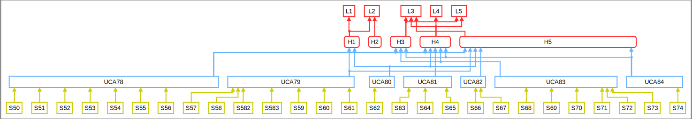

 

#### _GroundStation.trajectory_

_UCA88_  
**S75**: Ground station executed the send the flight plan to UAV command, while there was a mechanical failure on it.
    -Someone had tampered with the UAV. 
    -It was damaged due to hardware failure.
    -It was damaged due to flying in winds more than 4 Beaufort.   
    -It was damaged due to flying during rain.
    -It was damaged due to a collision with an object.  

_UCA91_  
**S76**: Ground station executed the send the flight plan to UAV command, while the battery was not charged adequately, because the admin was at the UAV base station and the UAV does not have a feedback of the level of the battery (the only way to see the battery level when you are near the UAV is by using a voltage meter)  
**S77**: Ground station executed the send the flight plan to UAV command, while the battery was not charged adequately, because the admin was not at the ground station in order to be able to monitor the battery level through Mission Planner.  

_UCA92_  
**S78**: Ground station executed the send the flight plan to UAV command, while more than one motors was damaged/not working properly, because
    -Someone had tampered with the UAV. 
    -It was damaged due to hardware failure.
    -It was damaged due to flying in winds more than 4 Beaufort.   
    -It was damaged due to flying during rain.
    -It was damaged due to a collision with an object.  
**S79**: Ground station executed the send the flight plan to UAV command, while more than one motors was damaged/not working properly, because a feedback that informs the admin that a UAV motor is malfunctioning does not exist.  

_UCA93_  
**S80**: Ground station executed the send the flight plan to UAV command, while more than one propeller was damaged/not working properly, because
    -Someone had tampered with the UAV. 
    -It was damaged due to hardware failure.
    -It was damaged due to flying in winds more than 4 Beaufort.   
    -It was damaged due to flying during rain.
    -It was damaged due to a collision with an object.  
**S81**: Ground station executed the send the flight plan to UAV command, while more than one propeller was damaged/not working properly, because a feedback that informs the admin that a UAV propeller is malfunctioning does not exist.  

_UCA94_  
**S82**: Ground station executed the send the flight plan to UAV command, while both a motor and a propeller, on different wings, were damaged/not working properly. 
    -Someone had tampered with the UAV. 
    -It was damaged due to hardware failure.
    -It was damaged due to flying in winds more than 4 Beaufort.   
    -It was damaged due to flying during rain.
    -It was damaged due to a collision with an object.  
**S83**: Ground station executed the send the flight plan to UAV command, while both a motor and a propeller, on different wings, were damaged/not working properly, because a feedback that informs the admin that a UAV propeller and a motor is malfunctioning does not exist.  

_UCA98_  
**S84**: Ground station did not execute the send the flight plan to UAV command, while a user has pressed the HELP button, because someone had closed the Mission planner or the laptop.  
**S85**:  Ground station did not execute the send the flight plan to UAV command, while a user has pressed the HELP button, because the laptop had turned off or the mission planner was not running, 
    -Because the laptop had closed due to installing a software update
    -Because the laptop did not have enough battery,
    -Because someone turned it off while the admin was not paying attention to the ground station.  
**S86**: Ground station did not execute the send the flight plan to UAV command, while a user has pressed the HELP button, because the tablet and the laptop lost the connection with each other.  
**S87**: Ground station did not execute the send the flight plan to UAV command, while a user has pressed the HELP button, because the tablet turned off,
    -Because the tablet had closed due to installing a software update
    -Because the tablet did not have enough battery,
    -Because someone turned it off while the admin was not paying attention to the ground station.  
**S88**: Ground station did not execute the send the flight plan to UAV command, while a user has pressed the HELP button, because the user had left the boundaries of the supervised area due to:
    -not knowing where the boundaries are, 
    -not being correctly informed about the way that the system operates while receiving the SW,
    -not considering this information (where the borders are) as important.  
**S89**: Ground station did not execute the send the flight plan to UAV command, while a user has pressed the HELP button, because the mobile network was not working and the SMS message could not be sent.  
**S90**: Ground station did not execute the send the flight plan to UAV command, while a user has pressed the HELP button, because the SW did not had enough credit to send the SMS, due to the admin not making sure of that.  
**S91**: Ground station did not execute the send the flight plan to UAV command, while a user has pressed the HELP button, because the SW malfunctioned.  
**S92**: Ground station did not execute the send the flight plan to UAV command, while a user has pressed the HELP button, because the user had pressed the CANCEL button while still in need of rescue, 
    -due to panicking
    -due to not being correctly inform about how to operate the SW.  

_UCA99_  
**S93**: Ground station executed the send the flight plan to UAV command, after the coordinates update has stopped and the user had changed position, because the time frame between the updating of the user's coordinates had been set incorrectly according to the conditions that exist in the supervised area.  
**S94**: Ground station executed the send the flight plan to UAV command, after the coordinates update has stopped and the user had changed position, due to a malfunction of the mobile network and the SMS messages with the updated coordinates could not be delivered.  
**S95**: Ground station executed the send the flight plan to UAV command, after the coordinates update has stopped and the user had changed position, because the SW did not had enough credit in the SIM card in order to update the coordinates of the user, due to the admin not checking it.  
**S96**: Ground station executed the send the flight plan to UAV command, after the coordinates update has stopped and the user had changed position, because the laptop and the tablet lost their connection while the mission was in operation.  
**S97**: Ground station executed the send the flight plan to UAV command, after the coordinates update has stopped and the user had changed position, because the SW malfunctioned and stopped sending the SMS.  
**S98**: Ground station executed the send the flight plan to UAV command, after the coordinates update has stopped and the user had changed position, due to a malfunction of the SW's GPS.  

_UCA100_  
**S100**: Ground station executed the send the flight plan to UAV command, before the life ring has been mounted on the UAV, because the admin did not had enough time between two missions in order to mount the life ring, because the UAV station was too far away from the ground station.  
**S101**: Ground station executed the send the flight plan to UAV command, before the life ring has been mounted on the UAV, because admin started the operation of the system without mounting the life ring.  
**S102**: Ground station executed the send the flight plan to UAV command, before the life ring has been mounted on the UAV, because the admin had not mounted the life ring correctly and it fell as soon as the UAV took off.  
**S103**: Ground station executed the send the flight plan to UAV command, before the life ring has been mounted on the UAV, because the release mechanism of the life ring was malfunctioning and dropped it.  
**Scenario105**: Ground station executed the send the flight plan to UAV command, before the life ring has been mounted on the UAV, because the admin mounted the life ring before connecting the UAV with the Mission Planner.  

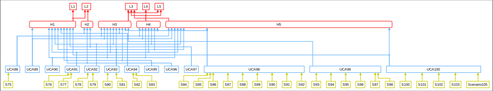

 

### All Scenarios

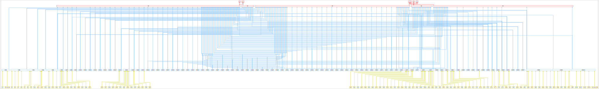

 

## Safety Requirements

**SR1**: ... [S1]  
**SR2**: ... [S102]  

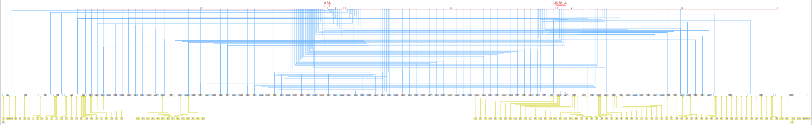

 

## Summarized Safety Constraints

**SC1**: ROLFER must be properly prepared for its mission. [H1]  
**SC2**: Every SP must be adequately served during the phase of preparation and handling of a SW [H2]  
**SC3**: The UAV must approach the distressed human [H3]  
**SC4**: The UAV must not violate the minimum separation distance between itself and a person or an object/obstacle on the beach or the water level [H4]  
**SC5**: The UAV must approach the SP and must provide rescue assistance to them [H5]  
**SR1**: ... [S1]  
**SR2**: ... [S102]  

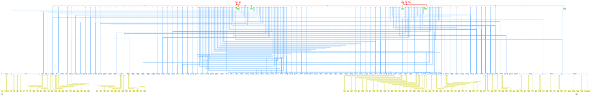

  

STPA Report generated by PASTA, 2025-02-06 16:55:20 (https://github.com/kieler/stpa)